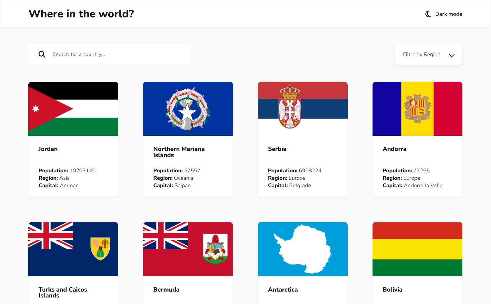

# Frontend Mentor - REST Countries API with color theme switcher solution

This is a solution to the [REST Countries API with color theme switcher challenge on Frontend Mentor](https://www.frontendmentor.io/challenges/rest-countries-api-with-color-theme-switcher-5cacc469fec04111f7b848ca). Frontend Mentor challenges help you improve your coding skills by building realistic projects. 

## Table of contents

- [Overview](#overview)
  - [The challenge](#the-challenge)
  - [Screenshot](#screenshot)
  - [Links](#links)
- [My process](#my-process)
  - [Built with](#built-with)
  - [What I learned](#what-i-learned)
  - [Continued development](#continued-development)
- [Author](#author)

## Overview

### The challenge

Users should be able to:

- See all countries from the API on the homepage
- Search for a country using an `input` field
- Filter countries by region
- Click on a country to see more detailed information on a separate page
- Click through to the border countries on the detail page
- Toggle the color scheme between light and dark mode 

### Screenshot

### Links

- Solution URL: [Add solution URL here](https://your-solution-url.com)
- Live Site URL: [https://leqsar.github.io/countries-app/](https://leqsar.github.io/countries-app/)

## My process

### Estimated time

14 hours

### Actual time

20 hours

### Built with

- Semantic HTML5 markup
- Flexbox
- CSS Grid
- [Vue](https://vuejs.org/) - Vue framework
- [SASS](https://sass-lang.com/)
- [Vite](https://vitejs-dev.translate.goog/?_x_tr_sl=en&_x_tr_tl=ru&_x_tr_hl=ru&_x_tr_pto=sc)
- [Countries API](https://restcountries.com)

### What I learned

- Had some practice with computed properties and watchers

### Continued development

In future projects I want to focus on more elegant search and filter functions and especially on their combinations (right now this app have some bugs with simultaneous process of searching and filtering). So I want to give an Elastic search a try. Also I would like to try some beautiful day and night mode switching animations.

## Author

- Frontend Mentor - [@leqsar](https://www.frontendmentor.io/profile/yourusername)

